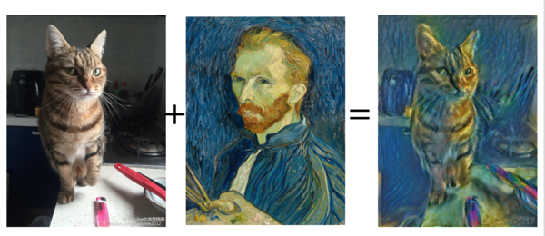

# Art Generation using Neural Style Transfer

Inputs a content image and a style image. Takes content of content image and generates an image with that using Neural Networks, but with the style extracted from style image.

## Requirements
- Tensorflow < 1.12
- Python 3.5+
- MatplotLib
- Imageio
- Numpy

## Downloading pre-trained Model:

[Click Here](https://www.kaggle.com/teksab/imagenetvggverydeep19mat/downloads/imagenetvggverydeep19mat.zip/1) to download pre-trained VGG model used in order to generate the images.

## To Run:

- Download the pretrained model and place it in a folder named "pretrained-model"
- Run the Jupyter Notebook

### Work in Progress:
- Web implementation for easy access
